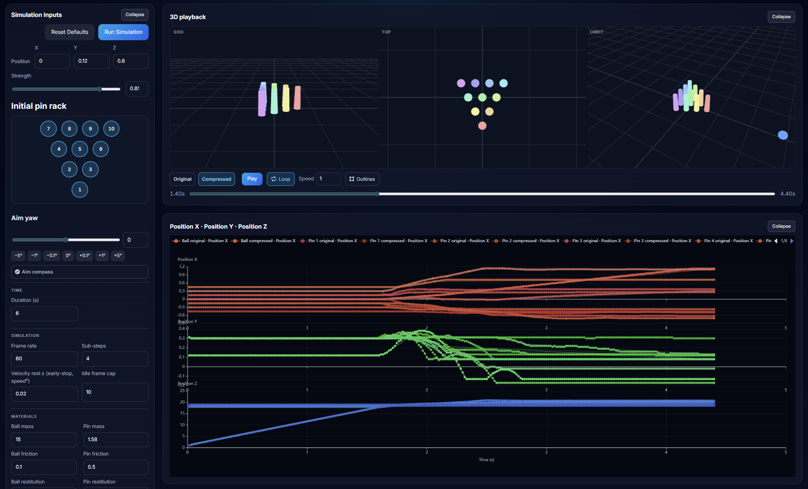

# dcl-bowling-visualiser



A local lab for **bowling physics**, **keyframe compression**, and **on-wire size** when building a bowling experience in **Decentraland with SDK 7**. It exists mainly so sim parameters and optimization strategies can be tried quickly without shipping a full scene each time.

The work was motivated in part by **authoritative-server message limits**: roll playback has to fit whatever envelope your server accepts, so shrinking keyframe payloads matters as much as "looking right" in the client.

---

## Main game project (placeholder)

**[TODO: add the public URL or repo for the actual Decentraland bowling project here — this visualiser is a companion tool, not the shipped game.]**

*(Replace this block with a real link when the project is published.)*

---

## What you get

- **Cannon-es** lane + ball + pins simulation with tunable settings (see `src/bowling/physics/`).
- **Keyframe optimization** pipeline with comparable **before/after** metrics in the UI.
- **Wire-accurate byte estimates** for a roll-playback-style payload using the same **Decentraland ECS serialization** path the SDK uses—not hand-counted field sizes.
- Optional **Vue + Three.js + ECharts** dashboard for charts, 3D playback, and comparisons.

For **copying the sim into another codebase**, see [`REINTEGRATION.md`](./REINTEGRATION.md).

---

## Stack and packages

| Area | Packages |
|------|-----------|
| UI & build | [Vue 3](https://vuejs.org/), [TypeScript](https://www.typescriptlang.org/), [Vite](https://vite.dev/) |
| 3D view | [three.js](https://threejs.org/) |
| Charts | [Apache ECharts](https://echarts.apache.org/) via [vue-echarts](https://github.com/ecomfe/vue-echarts) |
| Physics | [cannon-es](https://github.com/pmndrs/cannon-es) |
| DCL alignment | [`@dcl/sdk`](https://docs.decentraland.org/creator/development-guide/sdk7/) (and ECS serialization pulled in for wire sizes; see below) |

`package.json` pins `@dcl/sdk` so schema layout stays aligned with what you measure on the server. If your authoritative build uses a different SDK revision, align this repo’s dependency (or add a matching `@dcl/ecs`) so byte counts stay comparable to your `room.ts` helpers.

---

## How wire size estimates work

The visualiser does **not** approximate message size by adding up “a float is 4 bytes” by hand.

Instead, `src/bowling/visualizer/message-bus-roll-playback-size.ts` builds the same **logical payload** as an authoritative **notify player roll playback** style message and serializes it with:

- **`Schemas`** from `@dcl/sdk/ecs`
- **`ReadWriteByteBuffer`** from `@dcl/ecs` (`serialization/ByteBuffer`)

…mirroring the pattern described in that file’s comments (event envelope + roll replay body + custom-event wrapper byte). The reported length is the **binary** size from that buffer—i.e. what you care about for **message size limits** on the new authoritative server.

**Note:** the charts can also show a separate **JSON UTF-8** “text footprint” per keyframe (`keyframe-json-footprint.ts`). That metric is useful for intuition in the UI only; **on-wire limits** should use the **SDK `Schemas` wire** estimate above.

---

## Keyframe optimizations (brief)

Implementation lives in `src/bowling/physics/physics.keyframe-optimization.ts`. Tracks are processed in **`compressTrack`**: **RDP first**, then **plateau / redundant-key removal**.

### 1. Plateau-style “three-point” reduction (`removeRedundantKeyframes`)

For each inner keyframe, **position** is kept only if the middle point differs from both neighbours (within an epsilon in **world units**). **Rotation** uses a quaternion similarity threshold (`1 - |dot|`). If both channels would be omitted, the keyframe is dropped—so **flat runs** (same pose before and after) collapse and you avoid storing redundant samples along a **plateau**.

### 2. Ramer–Douglas–Peucker (RDP)

The sim emits sparse keys (position and/or rotation may be omitted on a sample and carried forward). The code **materializes** a dense time series, then runs **RDP** separately on **position** and **rotation** tolerances. **Kept indices are merged (union)** so one time index can carry only position, only rotation, or both—e.g. a straight approach can stay sparse on position while spin still gets its own keys.

### 3. Pin pre-contact anchor

After compression, **pin** tracks can get a **pre-contact rest anchor** derived from the original track so interpolation does not “ease” pins before real motion (see `injectPrecontactRestAnchorForPinTrack` in the same file).

Together, these are the levers the UI exposes for experimenting with **quality vs byte count** under your server’s caps.

---

## Try it locally (command line)

1. **Prerequisites:** [Node.js](https://nodejs.org/) (LTS recommended) and npm.
2. Clone or download this repository and open a terminal in the project root.
3. Install dependencies:

   ```bash
   npm install
   ```

4. Start the dev server:

   ```bash
   npm run dev
   ```

5. Open the URL Vite prints (typically **<http://localhost:5173/>**) in your browser.

Other scripts: `npm run build` (typecheck + production build), `npm run preview` (serve the production build locally).

---

## Try it in Cursor

1. **File → Open Folder…** (or **Open Workspace**) and select the repository root (`dcl-bowling-visualiser`).
2. Open the integrated terminal (**Ctrl+`** / **Cmd+`** ) and run `npm install` once, then `npm run dev`.
3. Use the **Ports** / simple browser preview if your Cursor setup offers it, or copy the localhost URL into any browser.

No extra Cursor configuration is required beyond having Node available on your PATH.

---

## Preview image

The banner at the top expects **`./docs/preview.png`**. If the image is missing, add your screenshot there so the README renders correctly on Git hosts.

---

## Meta: how the interface was built

The **visual interface** in this repository was produced with **Cursor Composer 2** and **voice dictation**—a practical way to stand up **internal testing** tools quickly, even when the result is not polished enough to ship as a consumer product.

---

## Vue template note

This project started from the standard **Vue 3 + TypeScript + Vite** starter; the bowling-specific layers live under `src/bowling/` and `src/components/`.
