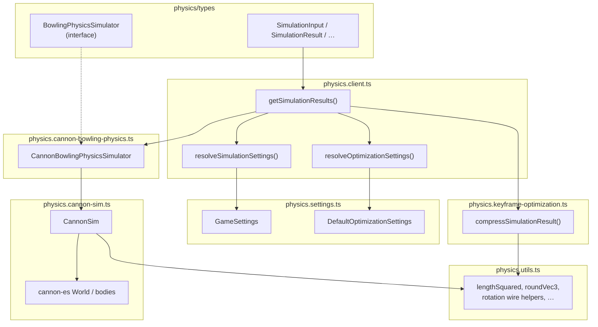
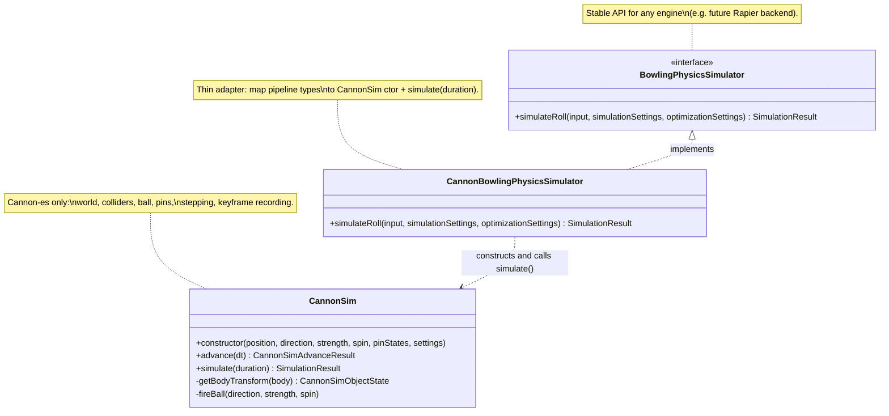
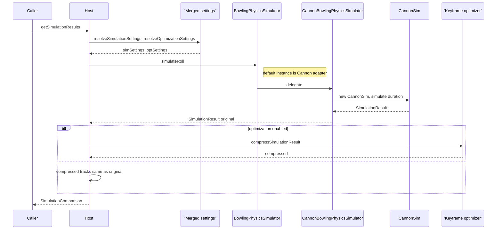

# Bowling physics module

Portable roll simulation (Cannon-es today), keyframe optimization, and shared settings. Copy **`physics/` as a unit** — it contains `types/` (`bowling-sim` contracts + DCL re-exports), `colliders/*.json`, and these modules — into another project if you reuse the pipeline.

The diagrams below describe how the **wrapper** (`BowlingPhysicsSimulator`), **adapter** (`CannonBowlingPhysicsSimulator`), and **engine** (`CannonSim`) relate.

---

## File cheat sheet

| File | Role |
|------|------|
| `physics.client.ts` | Host API: `getSimulationResults`, defaults, merge helpers. |
| `physics.settings.ts` | Default values `GameSettings`, `DefaultOptimizationSettings` (types imported from `./types`). |
| `types/` | Simulation contracts (`bowling-sim.ts`), `index.ts` re-exporting `@dcl/ecs` / `@dcl/sdk/math` primitives. |
| `physics.cannon-bowling-physics.ts` | **Adapter**: `BowlingPhysicsSimulator` → `CannonSim`. |
| `physics.cannon-sim.ts` | **Engine**: Cannon world, colliders from `colliders/*.json`, sampling. |
| `physics.utils.ts` | Engine-agnostic math / keyframe rotation helpers. |
| `physics.keyframe-optimization.ts` | Reduces keyframes after simulation (optional). |
| `colliders/*.json` | Lane / pin / bumper collision data consumed by `CannonSim`. |

`simulateRoll` receives `optimizationSettings` so the **call shape** stays the same for every backend; Cannon ignores it during integration, and the client applies compression **after** simulation.

---

## Module dependency (data flow)

---

## Class / interface roles

---

## One `getSimulationResults()` call (sequence)

Mermaid is picky about dots in participant IDs and about `alt` nesting; this version uses plain IDs (see labels below).

| ID in diagram | Code |
|---------------|------|
| Host | `physics.client.ts` (`getSimulationResults`) |
| R | `resolveSimulationSettings` + `resolveOptimizationSettings` |
| I | Interface `BowlingPhysicsSimulator` (parameter or default) |
| A | `CannonBowlingPhysicsSimulator` |
| E | `CannonSim` |
| K | `compressSimulationResult` in `physics.keyframe-optimization.ts` |

---
